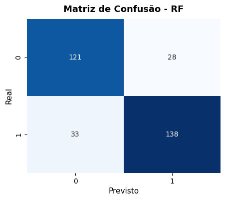
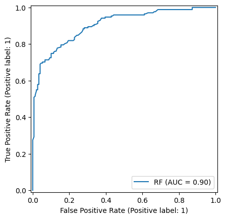
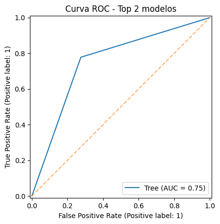

# 🍷 Wine Quality Predictor

Projeto de Machine Learning que prevê a qualidade de vinhos com base em propriedades físico-químicas, utilizando algoritmos de classificação supervisionada.

---

## 🎯 Objetivo

Desenvolver um **modelo de classificação supervisionado** capaz de prever a **qualidade de vinhos tintos** a partir de suas características químicas.  
Este projeto foi desenvolvido como parte da **CP5 – Inteligência Artificial e Machine Learning (FIAP)**.

O trabalho aplica um **pipeline completo de ciência de dados**, incluindo:
- Exploração e limpeza dos dados  
- Preparação e padronização das variáveis  
- Treinamento e comparação de modelos  
- Avaliação de métricas de desempenho  
- Interpretação dos resultados e insights

---

## 🧩 Dataset

**Fonte:** [UCI Machine Learning Repository – Wine Quality](https://archive.ics.uci.edu/ml/machine-learning-databases/wine-quality/winequality-red.csv)

- **Amostras:** 1.599  
- **Variáveis:** 11 atributos físico-químicos (acidez, álcool, sulfatos, etc.)  
- **Alvo:** nota de qualidade (0–10), convertida em classificação binária:  
  - `0` → qualidade ≤ 5 (baixa qualidade)  
  - `1` → qualidade ≥ 6 (boa qualidade)

---

## 🧠 Pipeline do Projeto

1. **Exploração Inicial**  
   Verificação de valores ausentes, duplicados e estatísticas descritivas.  
2. **Pré-processamento**  
   - Padronização das variáveis numéricas com `StandardScaler`  
   - Divisão estratificada entre treino e teste (80/20)  
3. **Treinamento dos Modelos**  
   Foram testados **7 algoritmos supervisionados**:
   - Regressão Logística  
   - Análise Discriminante Linear (LDA)  
   - Naive Bayes Gaussiano  
   - K-Vizinhos Mais Próximos (KNN)  
   - Máquina de Vetor de Suporte (SVM)  
   - Árvore de Decisão  
   - Random Forest  
4. **Avaliação dos Modelos**  
   Métricas utilizadas:
   - Acurácia  
   - Precisão  
   - Revocação (Recall)  
   - F1-Score  
   - ROC-AUC  
5. **Visualizações**  
   - Curva ROC (Top 2 modelos)  
   - Matriz de Confusão  
   - Importância das variáveis (Random Forest)

---

## 📊 Resultados

| Modelo | Acurácia | Precisão | Revocação | F1 | ROC_AUC |
|:-------|:---------:|:---------:|:----------:|:--:|:--------:|
| **Random Forest** | **0.81** | 0.83 | 0.81 | **0.82** | **0.90** |
| Decision Tree | 0.75 | 0.74 | 0.78 | 0.77 | 0.75 |
| SVM | 0.76 | 0.81 | 0.72 | 0.77 | 0.83 |
| LDA | 0.75 | 0.78 | 0.73 | 0.76 | 0.83 |
| KNN | 0.74 | 0.78 | 0.74 | 0.76 | 0.78 |
| Regressão Logística | 0.74 | 0.78 | 0.74 | 0.76 | 0.82 |
| Naive Bayes | 0.72 | 0.77 | 0.67 | 0.72 | 0.78 |

📈 **Melhor modelo:** Random Forest  
- F1-Score ≈ **0.82**  
- AUC ≈ **0.90**  
- Equilíbrio entre precisão e revocação  
- Poucos falsos negativos na matriz de confusão  

---

## 🔍 Principais Insights

- As variáveis com maior influência foram **álcool**, **sulfatos** e **acidez volátil**.  
- Vinhos com **maior teor alcoólico** e **mais sulfatos** tendem a receber notas mais altas.  
- Já a **acidez volátil elevada** prejudica a avaliação sensorial, indicando vinhos de menor qualidade.  
- O modelo Random Forest conseguiu capturar essas relações não lineares entre as variáveis com excelente desempenho.

---

## 🧾 Conclusão

O modelo **Random Forest** apresentou o melhor desempenho geral, alcançando equilíbrio entre métricas e boa capacidade de generalização.  
Além de fornecer ótimos resultados de classificação, também permitiu interpretar quais atributos químicos mais influenciam a percepção de qualidade.

**Próximos passos sugeridos:**
- Aplicar ajuste fino de parâmetros (GridSearchCV)  
- Usar validação cruzada (Cross-Validation)  
- Testar seleção de variáveis ou PCA para reduzir redundância  

---

## 🛠️ Tecnologias Utilizadas
- **Python 3**  
- **Pandas**, **NumPy**  
- **Scikit-learn**  
- **Seaborn**, **Matplotlib**  
- **Google Colab / Jupyter Notebook**

---

## 📸 Exemplos de Saída

**Matriz de Confusão (Random Forest)**  

**Curva ROC – Random Forest (AUC = 0.90)**  

**Curva ROC – Decision Tree (AUC = 0.75)**  

---

## 👤 Autor

**Leonardo José Pereira**  
RM563065 — FIAP  
📧 [Perfil no GitHub](https://github.com/leojp04)
📧 [Link Repositorio](https://github.com/leojp04/wine-quality-predictor)
---

✅ *Projeto desenvolvido como parte da avaliação CP5*
